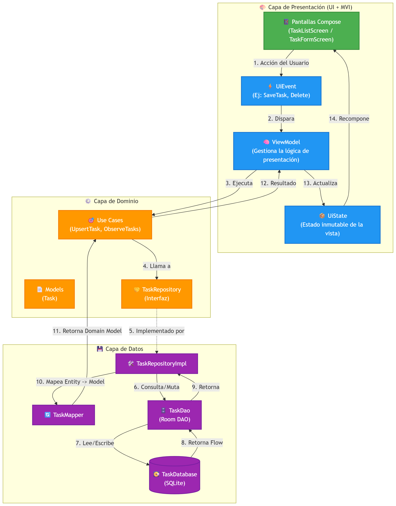
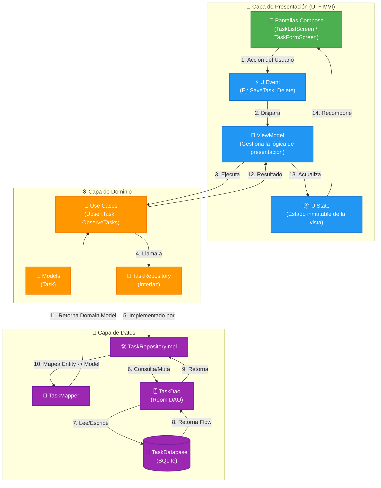

# RegistroSimple

RegistroSimple es una aplicación Android moderna que demuestra la implementación de las mejores prácticas de arquitectura recomendadas por Google. El proyecto está construido para gestionar un registro de tareas utilizando un enfoque reactivo, limpio y escalable.

## 🚀 Tecnologías y Librerías

- **[Kotlin](https://kotlinlang.org/)**: Lenguaje de programación principal.
- **[Jetpack Compose](https://developer.android.com/jetpack/compose)**: Toolkit moderno para la construcción de UI declarativa.
- **[Navigation Compose](https://developer.android.com/jetpack/compose/navigation)**: Para la navegación Type-Safe entre pantallas mediante `kotlinx.serialization`.
- **[Dagger Hilt](https://dagger.dev/hilt/)**: Inyección de dependencias para un acoplamiento suelto.
- **[Room Database](https://developer.android.com/training/data-storage/room)**: Abstracción sobre SQLite para persistencia de datos local robusta.
- **[Coroutines & Flow](https://kotlinlang.org/docs/coroutines-overview.html)**: Programación asíncrona y flujos de datos reactivos.
- **[KSP](https://kotlinlang.org/docs/ksp-overview.html)**: Kotlin Symbol Processing para una generación de código rápida (Hilt y Room).

## 🏗️ Arquitectura (Clean Architecture + MVI)

El proyecto sigue los principios de **Clean Architecture** estructurado en múltiples capas, en conjunto con el patrón **MVI** (Model-View-Intent) para la capa de presentación. Esto garantiza una separación de responsabilidades estricta, un código altamente testeable y flujos de estado predecibles (Unidirectional Data Flow).

### Diagrama de Flujo (MVI + Clean Architecture)

A continuación, se detalla el flujo de información de la aplicación:

## 📂 Estructura del Proyecto

El código fuente está organizado lógicamente por capas dentro del paquete base `edu.ucne.registrosimple`:

- **`di/`** (Dependency Injection): Contiene los módulos de Hilt (`DatabaseModule`, `RepositoryModule`) para proveer instancias a toda la app.
- **`data/`**: Capa de datos y persistencia.
  - `local/`: Entidades de Room, DAO y configuración de Base de Datos.
  - `mapper/`: Funciones de extensión para convertir entre Entidades (Data) y Modelos (Domain).
  - `repository/`: Implementación real de los repositorios.
- **`domain/`**: Reglas de negocio puras (sin dependencias de Android).
  - `model/`: Clases de datos del dominio principal (`Task`).
  - `repository/`: Interfaces de contrato que la capa de datos debe cumplir.
  - `usecase/`: Casos de uso atómicos que orquestan el repositorio y las validaciones.
- **`presentation/`**: Capa de presentación (UI y ViewModels).
  - `navigation/`: Definición segura de rutas y el host de Jetpack Compose (`TaskNavHost`).
  - `tareas/list/`: UI, Estado, Eventos y ViewModel para visualizar las tareas.
  - `tareas/edit/`: UI, Estado, Eventos y ViewModel para agregar/editar tareas.

## 🧪 Pruebas (Testing)

El proyecto está diseñado para ser testeable. Incluye pruebas unitarias e instrumentadas utilizando:
- **MockK**: Para simular dependencias.
- **Coroutines Test**: Para el testeo de flujos asíncronos y ViewModels (`InstantTaskExecutorRule`, `TestDispatcher`).
- **Compose Test Rule**: Para pruebas automatizadas de UI en Android.
